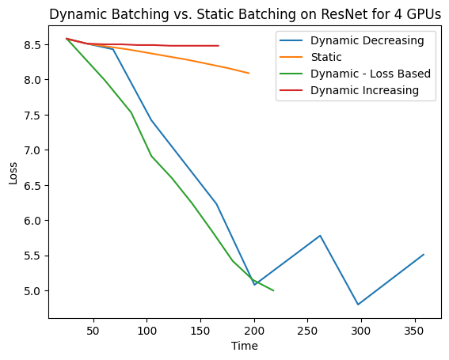
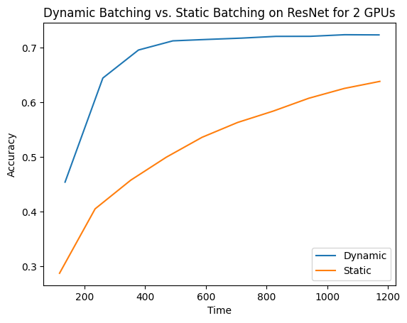
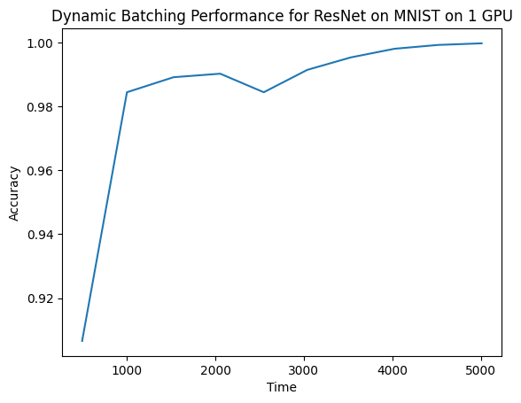
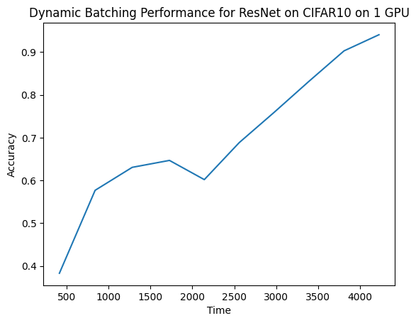

# COMS 6998 (High Perf Mach Learn) Final Project
Chris Chang (cwc2150) and Aidana Imangozhina (ai2523)

### Project Description 
For this project, we are exploring dynamic batching, described [here](https://arxiv.org/abs/2007.11831). 
Essentially, with synchronous strategies utilizing data parallelism during training (eg. synchronous 
stochastic gradient descent), there is some inefficiency because since the workers can finish their 
mini-batch at different times. Thus, by dynamically varying the batch sizes of each worker during training, 
we can potentially achieve greater computational efficiency. Note that in general machine learning 
literature, the precise meaning of dynamic batching varies across papers. For example, some papers 
dynamically vary mini-batch sizes during training, and other papers dynamically batch computations in the 
computation graph together. For our paper specifically, we dynamically vary batch size during training with
both one and many workers. 

### Code Repository Outline
Note that distributedDataParallel.py and main_adjworker.py are supplementary files for additional 
experimentation. We wanted to test dynamic batching under a variety of conditions, including in parallel,
so before our main experiment, we wrote a lot of extra code testing on various datasets as well. We have
included them because the results from those modules are also worth looking at, but they are not the core 
of our project. 

resnet.py: This file contains necessary model definitions for ResNet. This code was copied from 
[here](https://github.com/kuangliu/pytorch-cifar/blob/master/models/resnet.py). 

distributedDataParallel.py: This file demonstrates training ResNet on the CIFAR10 dataset using the 
DistributedDataParallel module from Pytorch. 

main_adjworker.py: This file demonstrates training ResNet on the MNIST dataset that adjusts batch sizes for 
each worker during the training process. 

main.py: This is the main experiment. This file runs dynamic batching using ResNet on the MNIST dataset 
under various parameters. 

dynamicbatching_1gpucifar10.ipynb: This file demonstrates running dynamic batching on the CIFAR10 dataset using 1 GPU. 

dynamicbatching_1gpumnist.ipynb: This file demonstrates running dynamic batching on the MNIST dataset using 1 GPU. 

### Example Commands 
To run ```main.py```, simply type ```python3 main.py``` into the command line. Below we list some additional
arguments that can be added: 
world_size: world_size of training environment 
lr: learning rate of SGD algorithm 
batch_size: starting batch size of algorithm 
n_epochs: number of epochs to train for

### Results and Observations
The complete raw results of all experiments can be viewed 
[here](https://docs.google.com/spreadsheets/d/1adBwBOmPLS-ncAkVbgwZ_ATcs_bPJR6sGlygCJfz3Bk/edit?usp=sharing).

Here are some of our summarized results. For the 4 GPU case, we present four different dynamic batching algorithms: 
dynamically increasing, dynamically decreasing, dynamically changing based on loss, and static.
 \
What is interesting is both dynamically decreasing and dynamically changing converged significantly quicker than static 
and dynamically increasing, which goes contrary to our initial intuition that you would want larger batch sizes near the 
end of training. We can attribute this to synchronization overhead when running dynamic batching in a data parallel 
environment. Our loss-based algorithm also seemed to decrease batch size when given the loss of the previous epoch. For 
the 2 GPU case, we show the results of a dynamic batching algorithm compared to a static batching scheme on accuracy:
 \
We can see that our dynamic batching algorithm behaves exactly as we expect it to behave in theory, with faster initial
convergence and stable convergence later on. Interestingly, our loss-based dynamic batching algorithm in this case chose
to decrease batch size in between epochs instead of increasing it. Across all time periods, we had better accuracy. 
Finally, we show an example of training accuracy using dynamic batching on both MNIST and CIFAR10 on 1 GPU: \
 \
 \
In both cases, we can see that dynamic batching results in fast initial convergence, but the smaller initial batch size 
leads to some instability in accuracy later on, given by the hump, and once the batch size is increased, we see steadier
convergence. 